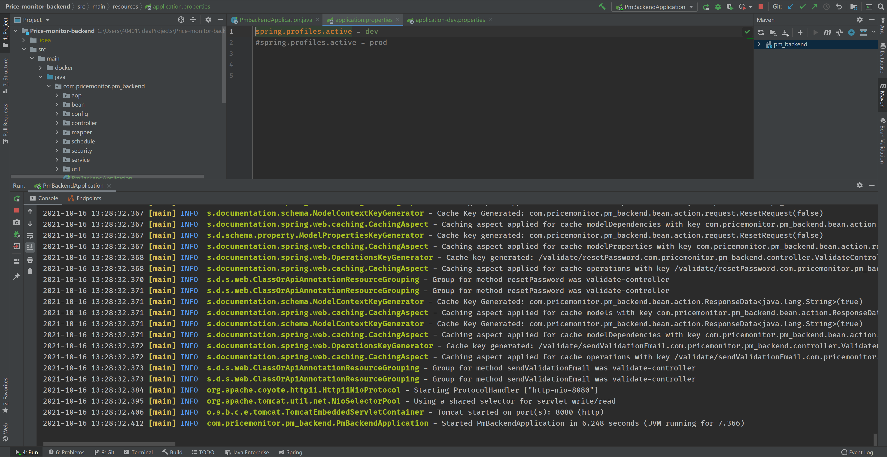

# Price-monitor-backend

本代码仓库是我的另一个开源项目：[某东商品价格监控](https://github.com/qqxx6661/Price-monitor) 的后端代码

使用最基础的SpringBoot+MySQL搭建而成，供大家学习参考。

## 使用方式

### 1. clone或者下载源代码

### 2. 配置数据库

安装mysql，可以是本地的也可以是其他服务器的

安装完成后，使用代码根目录中的pm_backend.sql写入数据表结构

### 3. 修改配置文件application.properties

主要是以下几个配置：

- 发送邮件邮箱配置

```
spring.mail.host=smtp.qq.com
spring.mail.username=xxxxxxxxx@qq.com
spring.mail.password=xxxxxxxxxxxxxxxxx
```

- 数据库连接配置

```
spring.datasource.driver-class-name = com.mysql.jdbc.Driver
spring.datasource.url = jdbc:mysql://localhost:3306/pm_backend?characterEncoding=utf-8
spring.datasource.username = root
spring.datasource.password = root
```

### 4. 启动SpringBoot：PmBackendApplication启动类



## 问题反馈

由于本仓库本人自从2020年后已经不再维护，对代码具体细节已有遗忘。

如果是通用的问题，建议自行谷歌解决。如果是细节的问题，可以给我留言：yangzd1993@foxmail.com 会尽量回复。

关注我的技术公众号：后端技术漫谈

关注我的生活公众号：蛮三刀酱